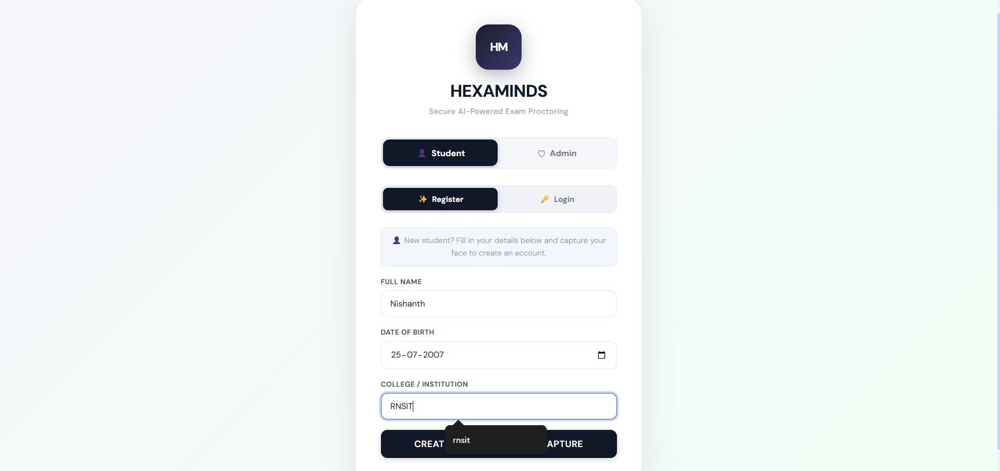
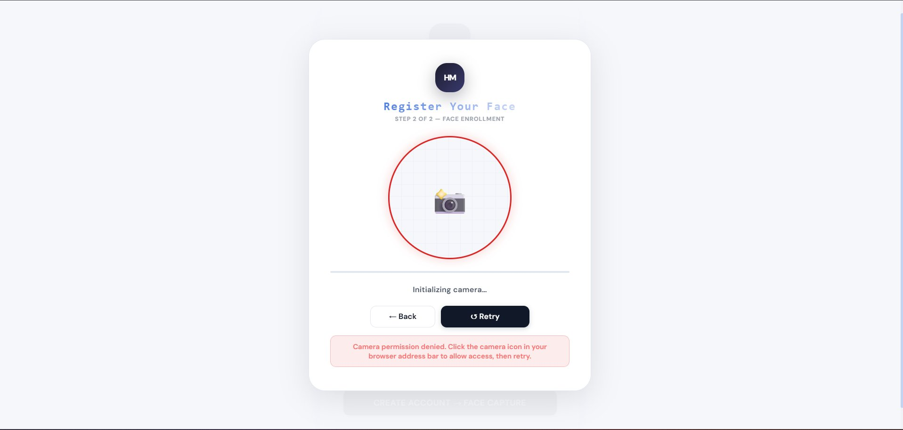
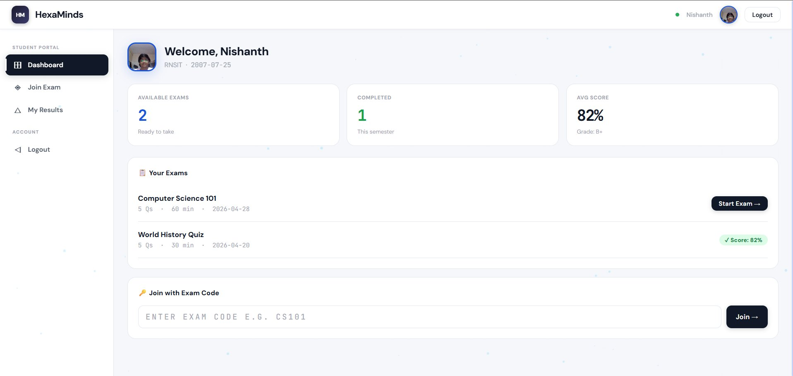
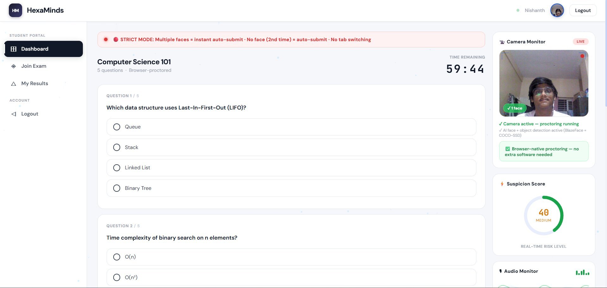
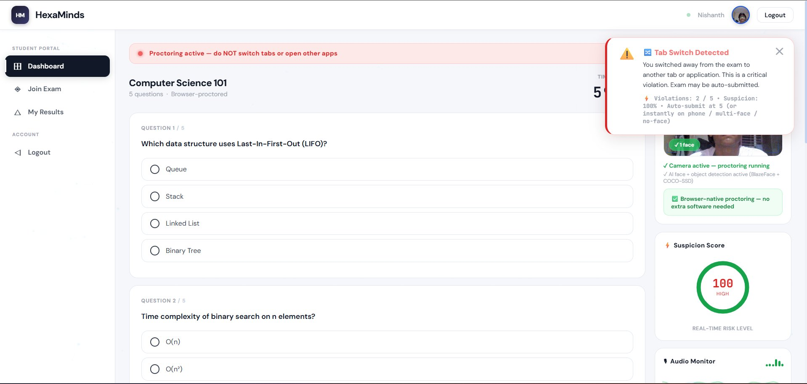
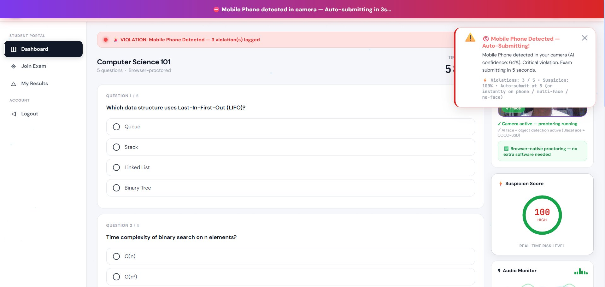
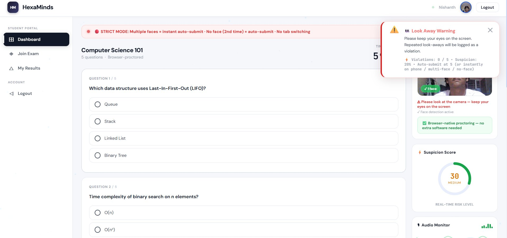

# HexaMinds — AI-Powered Exam Proctoring System

> Secure, browser-native exam proctoring using real-time AI face detection, object detection, and behavioral analysis. No installations, no plugins — runs entirely in the browser.


---

## What It Does

HexaMinds is a full-featured AI proctoring system built for colleges and institutions. It monitors students during online exams in real time and automatically flags or submits exams when violations are detected.

### Student Side
- Face enrollment with live camera capture
- Real-time suspicion scoring (Low → Medium → High)
- Automatic exam submission on critical violations
- Clean exam interface with timer

### AI Monitoring (runs 100% in browser)
- **Face detection** — alerts if no face or multiple faces detected
- **Object detection** — detects mobile phones (auto-submits instantly)
- **Look-away detection** — warns when student looks away from screen
- **Tab switch detection** — logs and alerts on window blur / alt-tab
- **DevTools blocking** — prevents F12, Ctrl+Shift+I, right-click during exam

### Admin Side
- Command center dashboard with live student monitoring
- Per-student violation logs with photo evidence captured at moment of violation
- Suspicion score tracking per student
- PDF export of violation reports and audit logs
- Login history tracking

---

## Tech Stack

| Layer | Technology |
|-------|-----------|
| Frontend | HTML5, CSS3, Vanilla JavaScript |
| AI - Face Detection | TensorFlow.js + BlazeFace |
| AI - Object Detection | TensorFlow.js + COCO-SSD |
| PDF Generation | jsPDF |
| Storage | localStorage (browser-native) |
| Fonts | DM Sans, JetBrains Mono (Google Fonts) |

**No backend. No server. No installation required.**  
Everything runs client-side in the browser.

---

## Features At A Glance

| Feature | Details |
|---------|---------|
| Face enrollment | Students register face on first login |
| Live camera monitor | Shown to student during exam |
| Suspicion score | Dynamic 0–100 score, updates in real time |
| Multiple faces | Instant auto-submit |
| No face detected | Warning → auto-submit on 2nd occurrence |
| Mobile phone detected | Auto-submit with countdown (64%+ AI confidence) |
| Tab switch / window blur | Logged as high violation, auto-submit at 5 violations |
| Look away warning | Medium severity, logged |
| Copy/paste/right-click | Blocked during exam |
| Admin live monitor | See all students + their suspicion scores live |
| Violation photo evidence | Camera frame captured at exact moment of violation |
| PDF reports | Export violation report + audit log as PDF |

---

## Screenshots

### Student Registration


### Face Enrollment


### Student Dashboard


### Exam Interface — Normal State


### Tab Switch Detected


### Mobile Phone Detected — Auto Submitting


### Look Away Warning


### Admin Violation Details


---

## How To Run

Since this is a single HTML file with no dependencies to install:

1. **Clone the repo**
   ```bash
   git clone https://github.com/yourusername/hexaminds-proctoring-system.git
   cd hexaminds-proctoring-system
   ```

2. **Open the file**
   ```bash
   # Just open in any browser
   open exam.html
   # or double-click the file in your file explorer
   ```

3. **Allow camera access** when the browser asks

4. **Student login**: Register with your name, DOB, college → capture face → join exam

5. **Admin login**:
   - Username: `hexaminds`
   - Password: `hexaminds123`

> **Note:** Camera access requires either `localhost` or `https`. If opening directly as a file doesn't allow camera, serve it locally:
> ```bash
> python -m http.server 8000
> # then open http://localhost:8000/exam.html
> ```

---

## Project Structure

```
hexaminds-proctoring-system/
│
├── exam.html              # Complete application (single file)
├── README.md              # This file
├── .gitignore             # Git ignore rules
└── screenshots/           # Screenshots for README
    ├── registration.png
    ├── face-enrollment.png
    ├── dashboard.png
    ├── exam-normal.png
    ├── tab-switch.png
    ├── phone-detected.png
    ├── look-away.png
    └── admin-violations.png
```

---

## Why I Built This

During COVID and post-COVID online exams, our college used third-party proctoring tools that were expensive, required downloads, and were often unfair to students with slow internet. I wanted to build something that:

- Works entirely in the browser — no software to install
- Uses real AI models (not just rule-based hacks)
- Gives transparent feedback to students in real time
- Gives professors a proper admin dashboard with evidence

---

## What I Learned

- How to run TensorFlow.js models (BlazeFace + COCO-SSD) in the browser without any backend
- Real-time video frame analysis using canvas + requestAnimationFrame
- Managing complex state in vanilla JS without a framework
- Browser security APIs (visibility change, window blur, keyboard blocking)
- Generating PDF reports with jsPDF including embedded images

---

## Future Improvements

- [ ] Firebase/Supabase backend for persistent multi-device data
- [ ] Real face recognition (not just detection) for identity verification
- [ ] Audio monitoring for unusual sounds
- [ ] Admin real-time dashboard with WebSockets
- [ ] Mobile responsive design

---

## Built By

**Nishanth** — [RNSIT](https://www.rnsit.ac.in)  
Connect on [LinkedIn](https://linkedin.com/in/yourprofile) | [GitHub](https://github.com/yourusername)

---

> ⭐ If you found this useful or interesting, consider starring the repo!
